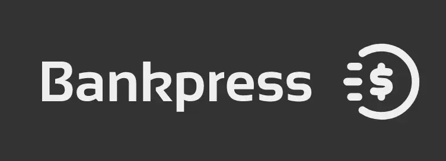

# BancoNET



## Instalar con Git
```bash
git clone https://github.com/RainBWP/BancoNET.git
git checkout -b FrontBank origin/FrontBank
```

## Ejecutar Frontend
```bash
cd front-end-banco-express
npm install
npm run dev
```

## Ejecutar Frontend con mosh-db
```bash
cd front-end-banco-express
npm install
npm run dev+mock
```

## Donde me ejecuto?
Puedes ingresar al backend desde las siguientes direcciones
```cmd
 ➜  Local:   http://localhost:3000/
 ➜  Network: http://[DEVICE_IP]:3000/
 ➜  Network: http://[ROUTER_IP]:3000/
```

## Como quiere acceder al backend?
El backend se accedera desde `localhost` usando el puerto `8080` asegurate de configurarlo correctamente